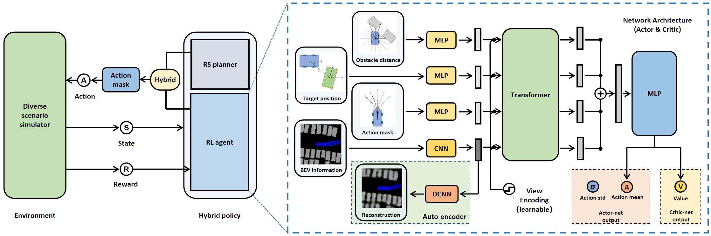

# HOPE + Dual-Model Parking Framework



本仓库基于原始论文 **HOPE: A Reinforcement Learning-based Hybrid Policy Path Planner for Diverse Parking Scenarios**，并在其上扩展了一个双模型泊车框架：

- 前向模型：负责常规泊入
- 泊出模型：负责从狭窄车位中脱困
- RS 连接：在需要时把前向轨迹和反向锚点连接起来
- 论文出图脚本：支持对比图、热力图、轨迹图导出

本 README 重点说明两件事：

1. 如何运行双模型
2. 如何导出论文图

## 1. 环境准备

建议使用已有的 `conda` 环境 `pytorch`。

```bash
cd /path/to/HOPE
conda run -n pytorch python -V
conda run -n pytorch pip install -r requirements.txt
```

如果是无界面服务器，建议统一使用 headless 环境变量：

```bash
export QT_QPA_PLATFORM=offscreen
export SDL_VIDEODRIVER=dummy
export MPLBACKEND=Agg
```

## 2. 仓库结构

核心目录：

- `src/model/ckpt/`：单模型预训练权重
- `src/train/`：训练脚本
- `src/evaluation/`：评测脚本
- `src/analysis/`：论文出图脚本
- `src/log/exp/`：训练输出
- `src/log/eval/`：评测输出
- `src/log/analysis/`：图像与案例导出结果

## 3. 单模型 HOPE 运行

仓库自带的单模型权重包括：

- `src/model/ckpt/HOPE_SAC0.pt`
- `src/model/ckpt/HOPE_SAC1.pt`
- `src/model/ckpt/HOPE_PPO.pt`

### 3.1 官方混合场景评测

```bash
cd /path/to/HOPE
QT_QPA_PLATFORM=offscreen SDL_VIDEODRIVER=dummy MPLBACKEND=Agg \
conda run -n pytorch python src/evaluation/eval_mix_scene.py \
  src/model/ckpt/HOPE_SAC0.pt \
  --eval_episode 2000 \
  --visualize False
```

说明：

- `--eval_episode 2000` 表示每个场景 2000 次，不是总共 2000 次
- 输出会写到 `src/log/eval/`

## 4. 泊出模型训练

双模型里的泊出模型由 `train_HOPE_unpark_ppo.py` 训练。

当前默认配置：

- 训练场景：`Complex,Extrem`
- 支持多环境并行：`--num_envs`
- 默认建议：`16` 环境

### 4.1 训练命令

```bash
cd /path/to/HOPE
QT_QPA_PLATFORM=offscreen SDL_VIDEODRIVER=dummy MPLBACKEND=Agg \
conda run -n pytorch python src/train/train_HOPE_unpark_ppo.py \
  --train_episode 50000 \
  --eval_episode 200 \
  --levels Complex,Extrem \
  --num_envs 16 \
  --visualize False \
  --verbose True
```

输出目录：

- `src/log/exp/unpark_ppo_<timestamp>/`

关键文件：

- `PPO_unpark_best.pt`
- `best.txt`
- `reward.png`
- `events.out.tfevents.*`

### 4.2 继续训练

```bash
cd /path/to/HOPE
QT_QPA_PLATFORM=offscreen SDL_VIDEODRIVER=dummy MPLBACKEND=Agg \
conda run -n pytorch python src/train/train_HOPE_unpark_ppo.py \
  --agent_ckpt /path/to/PPO_unpark_best.pt \
  --train_episode 50000 \
  --eval_episode 200 \
  --levels Complex,Extrem \
  --num_envs 16 \
  --visualize False \
  --verbose True
```

## 5. 双模型运行

双模型由：

- 前向 HOPE 模型
- 泊出 PPO 模型
- `BidirectionalParkingAgent`

共同组成。

### 5.1 双模型评测

当前正式入口：

- `src/evaluation/eval_extrem_bidirectional.py`

示例：

```bash
cd /path/to/HOPE
QT_QPA_PLATFORM=offscreen SDL_VIDEODRIVER=dummy MPLBACKEND=Agg \
conda run -n pytorch python src/evaluation/eval_extrem_bidirectional.py \
  src/model/ckpt/HOPE_SAC0.pt \
  /path/to/PPO_unpark_best.pt \
  --eval_episode 2000 \
  --visualize False \
  --verbose False
```

输出目录：

- `src/log/eval/bidirectional_extrem_<timestamp>/`

结果文件：

- `summary.json`
- `episode_details.json`

### 5.2 双模型指标解释

当前脚本会输出两类核心指标：

- `planning_success_rate`
  说明：是否成功触发双模型连接
- `final_parking_success_rate`
  说明：是否最终真正停进车位

补充指标：

- `connection_rate`
- `avg_step_num`
- `avg_total_path_length`
- `avg_total_gear_shifts`

### 5.3 当前连接机制

当前双模型采用“前向优先，卡顿时再连接”的策略：

- 简单场景尽量不接管
- 当前向明显卡顿时，再尝试连接反向锚点
- 如果 `connection_used = false`，前向轨迹会尽量和单模型保持一致

## 6. 单模型 / 双模型对比可视化

### 6.1 固定场景导出

脚本：

- `src/analysis/export_vector_case_plots.py`

示例：

```bash
cd /path/to/HOPE
QT_QPA_PLATFORM=offscreen SDL_VIDEODRIVER=dummy MPLBACKEND=Agg \
conda run -n pytorch python src/analysis/export_vector_case_plots.py \
  --forward_ckpt src/model/ckpt/HOPE_SAC0.pt \
  --unpark_ckpt /path/to/PPO_unpark_best.pt \
  --scene Normal:11850 \
  --scene Extrem:23 \
  --png_dpi 600 \
  --verbose True
```

输出目录：

- `src/log/analysis/vector_case_plots_<timestamp>/`

每个场景会导出：

- `single_vector.png/.svg/.pdf`
- `dual_vector.png/.svg/.pdf`
- `single_trace.json`
- `dual_trace.json`
- `vector_case_panel.png`

### 6.2 低换挡案例筛选

脚本：

- `src/analysis/build_low_shift_case_gallery.py`

示例：

```bash
cd /path/to/HOPE
QT_QPA_PLATFORM=offscreen SDL_VIDEODRIVER=dummy MPLBACKEND=Agg \
conda run -n pytorch python src/analysis/build_low_shift_case_gallery.py \
  --forward_ckpt src/model/ckpt/HOPE_SAC0.pt \
  --unpark_ckpt /path/to/PPO_unpark_best.pt \
  --max_seed 120 \
  --per_spec 2 \
  --png_dpi 480
```

## 7. 热力图导出

脚本：

- `src/analysis/build_relative_slot_heatmaps.py`

功能：

- 以目标车位为原点建立局部坐标系
- 统计动作主要耗费在哪些空间区域
- 可用于说明单模型在复杂场景中大量动作浪费在车位外

示例：

```bash
cd /path/to/HOPE
QT_QPA_PLATFORM=offscreen SDL_VIDEODRIVER=dummy MPLBACKEND=Agg \
conda run -n pytorch python src/analysis/build_relative_slot_heatmaps.py \
  --forward_ckpt src/model/ckpt/HOPE_SAC0.pt \
  --unpark_ckpt /path/to/PPO_unpark_best.pt \
  --level Complex \
  --max_seed 200 \
  --selection_mode single_hard \
  --min_single_steps 35 \
  --min_step_gain 15 \
  --png_dpi 360
```

输出目录：

- `src/log/paper_support/relative_slot_heatmaps_<timestamp>/`

## 8. 一键生成论文图包

脚本：

- `src/analysis/build_dual_framework_paper_package.py`

示例：

```bash
cd /path/to/HOPE
QT_QPA_PLATFORM=offscreen SDL_VIDEODRIVER=dummy MPLBACKEND=Agg \
conda run -n pytorch python src/analysis/build_dual_framework_paper_package.py \
  --forward_ckpt src/model/ckpt/HOPE_SAC0.pt \
  --unpark_ckpt /path/to/PPO_unpark_best.pt \
  --parking_type_seeds 100 \
  --scan_extrem_max_seed 200 \
  --png_dpi 320
```

输出目录：

- `src/log/paper_support/dual_framework_<timestamp>/`

常见结果包括：

- 各难度成功率对比图
- Bay / Parallel 成功率对比图
- 双模型分解图
- rescue case 图
- 规划结果图
- 热力图

## 9. 结果目录约定

训练输出：

- `src/log/exp/`

评测输出：

- `src/log/eval/`

分析与论文图：

- `src/log/analysis/`
- `src/log/paper_support/`

说明：

- `src/log/` 内容很多，不建议纳入 Git
- 本仓库的 `.gitignore` 已默认忽略这些目录

## 10. 重要说明

### 10.1 关于 `best.pt`

本仓库原始单模型权重不是 `best.pt` 命名，而是：

- `HOPE_SAC0.pt`
- `HOPE_SAC1.pt`
- `HOPE_PPO.pt`

泊出模型的最佳权重通常出现在：

- `src/log/exp/unpark_ppo_<timestamp>/PPO_unpark_best.pt`

### 10.2 关于 `Extrem Bay`

当前 benchmark 中没有单独定义 `Extrem Bay` 类型，因此：

- `Extrem` 的类型拆分图里通常只有 `Parallel`
- README 中相关命令不会伪造 `Extrem Bay` 数据

### 10.3 关于论文图脚本

部分论文图脚本默认读取 `src/log/eval/` 中已有的评测结果。
如果你更换了 checkpoint，需要：

1. 先重新运行对应评测
2. 或修改脚本头部的默认结果路径

## 11. Citation

如果你使用了原始 HOPE 工作，请引用：

```bibtex
@article{jiang2024hope,
  title={HOPE: A Reinforcement Learning-based Hybrid Policy Path Planner for Diverse Parking Scenarios},
  author={Jiang, Mingyang and Li, Yueyuan and Zhang, Songan and Chen, Siyuan and Wang, Chunxiang and Yang, Ming},
  journal={arXiv preprint arXiv:2405.20579},
  year={2024}
}
```
